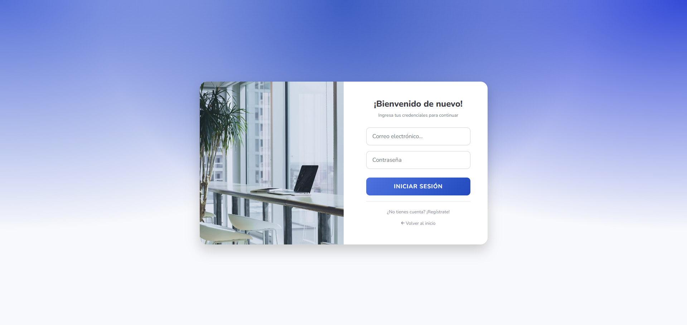
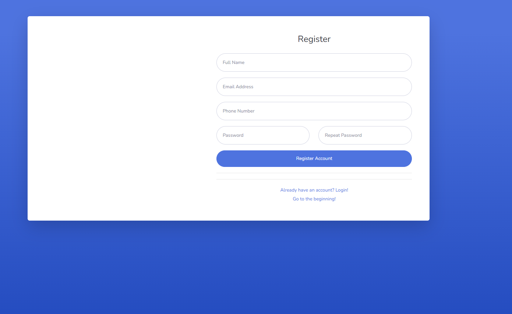
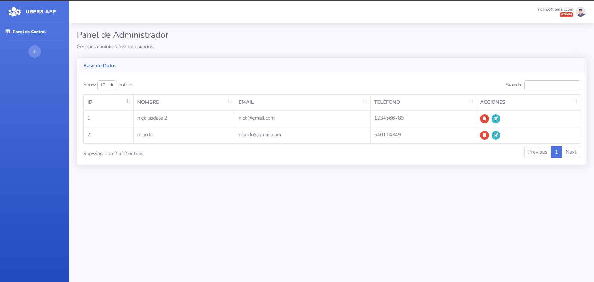
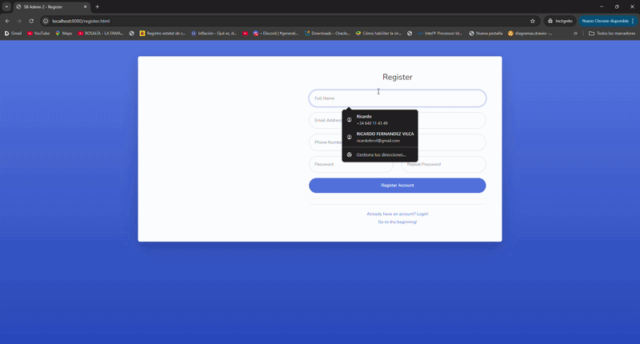

🛡️ Sistema de Gestión de Usuarios (Spring Boot + Docker)
Este es un proyecto Full-Stack diseñado para gestionar el registro, autenticación y roles de usuarios de forma segura y escalable. La aplicación está completamente "dockerizada", lo que permite desplegarla en cualquier entorno con un solo comando.

🚀 Características principales
Autenticación JWT: Seguridad basada en tokens para proteger las rutas de la API.

Gestión de Roles: Diferenciación entre usuarios estándar y administradores.

Base de Datos Relacional: Persistencia de datos con MySQL 8.0.

Despliegue con Docker: Configuración de contenedores para la aplicación y la base de datos mediante Docker Compose.

CORS Configurado: Preparado para conectar con frontends externos.

🛠️ Tecnologías utilizadas
Backend: Java 17, Spring Boot 3.x, Spring Data JPA.

Seguridad: JSON Web Tokens (JWT), BCrypt/Argon2 para hashing de contraseñas.

Base de Datos: MySQL 8.0.

Contenedores: Docker & Docker Compose.

Build Tool: Maven.

🛣️ API Endpoints
La API base se encuentra en: http://localhost:8080/api/auth

Ejemplo de Registro (POST /register):

Body (JSON):

{
"name": "Lucas Rossi",
"email": "lucas@example.com",
"password": "mi_password_segura",
"phoneNumber": "123456789"
}

Ejemplo de Login (POST /login):

Body (JSON):

{
"email": "lucas@example.com",
"password": "mi_password_segura"
}

Respuesta Exitosa (200 OK):

{
"token": "eyJhbGciOiJIUzI1NiIsInR5cCI6IkpXVCJ9...",
"role": "USER",
"email": "lucas@example.com"
}

🔐 Seguridad y JWT
Este proyecto utiliza JSON Web Tokens (JWT) para proteger los recursos. Una vez que el usuario hace login, debe incluir el token recibido en el encabezado de las peticiones protegidas.Formato del Header:Authorization: Bearer <tu_token_aqui>

📦 Instalación y Ejecución
No necesitas tener Java o MySQL instalados en tu sistema, solo necesitas Docker Desktop.

Clonar el repositorio:

git clone https://github.com/Ricckyfv/Gestion-de-usuarios

cd Gestion-de-usuarios

Construir el archivo ejecutable (.jar):

./mvnw clean package -DskipTests

Levantar los servicios con Docker:

docker-compose up --build

La aplicación estará disponible en: http://localhost:8080

📁 Estructura del Proyecto
src/main/java: Lógica del Backend (Controladores, Servicios, Modelos, Repositorios).

src/main/resources/static: Frontend de la aplicación (HTML, CSS, JS).

docker-compose.yml: Orquestación de contenedores MySQL y Spring Boot.

Dockerfile: Configuración de la imagen de la aplicación.

🔑 Credenciales por defecto (Entorno de Desarrollo)
Base de Datos:

User: root

Password: root

DB Name: gestionusuarios

Puerto de la API: 8080

### 📸 Capturas de Pantalla

#### Inicio de Sesión

#### Registro de Usuarios

#### Panel de Administración

### Video de Demostración

👤 Autor
Ricardo Fernández - www.linkedin.com/in/ricardo1995 - https://github.com/Ricckyfv